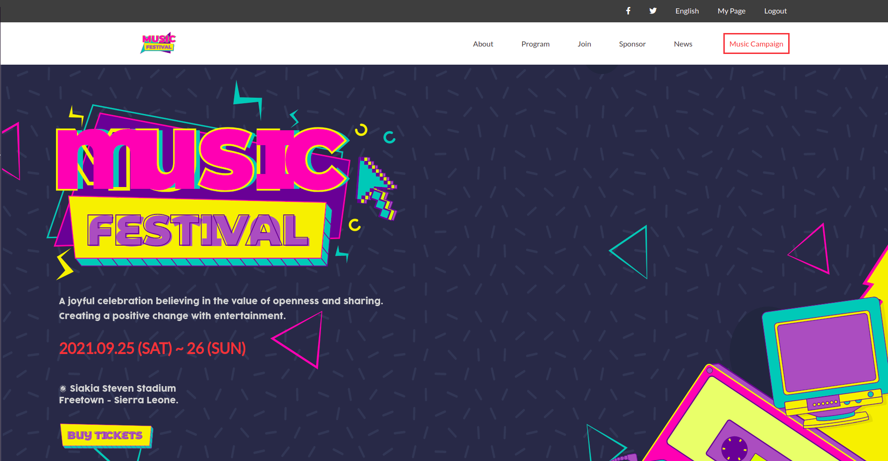

# microverse-capstone-project-one

> This is my capstone project on HTML + CSS + JAVASCRIPT. It's centred towards a music festival concert and showcases the different types of music and artists that will be performing. It also makes use of dynamic artist content that is coming from javascript and render into the DOM.

Homepage view                                     |  Main program view                             |
:------------------------------------------------:|:-----------------------------------------------:
           |  

Guests View                                       |  About view
:------------------------------------------------:|:-----------------------------------------------:
           |  

About second view                                 |  About footer view
:------------------------------------------------:|:-----------------------------------------------:
           |  

Desktop Landing                                  
:--------------------------------------------------------------------------------------------------:
   

## Built With

- HTML & CSS & JAVASCRIPT

## Link to project online
- [OnlineVersion](https://mmsesay.github.io/microverse-capstone-project-one/)

## Link to project recorded video
- [OnlineVersion](https://www.loom.com/share/ea911f26628a4ed1919244f1a0dedd7f)

## Authors

👤 **Author: Muhammad Mustapha Sesay**

- GitHub: [@mmsesay](https://github.com/mmsesay)
- Twitter: [@DeeMaejor](https://twitter.com/DeeMaejor)
- LinkedIn: [LinkedIn](https://linkedin.com/in/muhammad-m-sesay)

## 🤝 Contributing

Contributions, issues, and feature requests are welcome!

Feel free to check the [issues page](../../issues/).

## Show your support

Give a ⭐️ if you like this project!

## Acknowledgments
- microverseinc for the readme template
- Julieta Ulanovsky, Sol Matas, Juan Pablo del Peral and Jacques Le Bailly from [Freepik](https://twitter.com/DeeMaejor) for the background images
- Thanks to [Cindy shin](https://www.behance.net/adagio07) for the design.
## 📝 License

This project is [MIT](./MIT.md) licensed.
