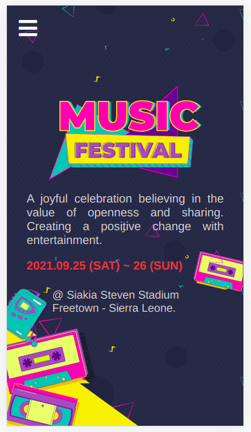
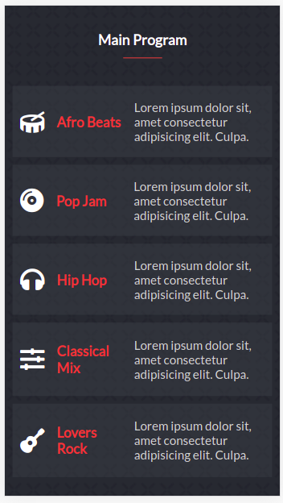
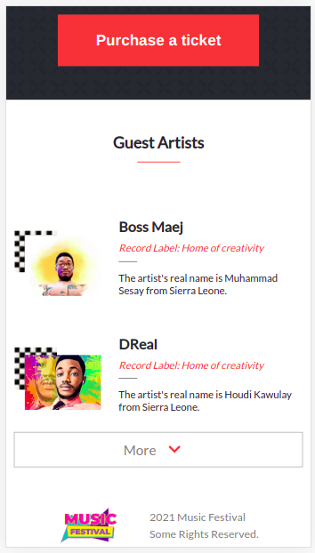
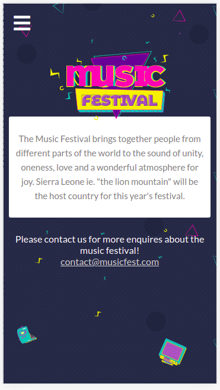
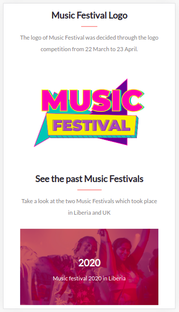
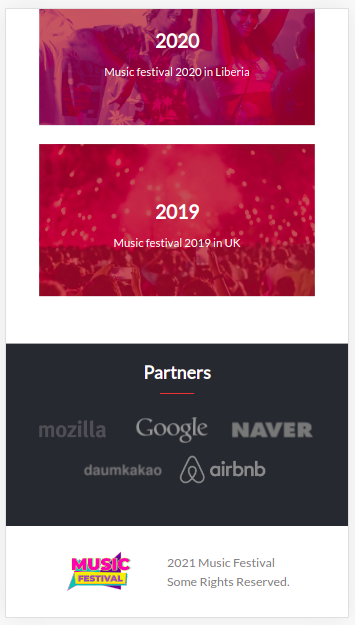

# microverse-capstone-project-one

> This project is my capstone project on HTML + CSS + JAVASCRIPT. My chosen topic is Music Festival.

Homepage view                                     |  Main program view                             |
:------------------------------------------------:|:-----------------------------------------------:
           |  

Guests View                                       |  About view
:------------------------------------------------:|:-----------------------------------------------:
           |  

About second view                                 |  About footer view
:------------------------------------------------:|:-----------------------------------------------:
           |  

## Built With

- HTML & CSS & JAVASCRIPT

## Link to project online
- [OnlineVersion](https://mmsesay.github.io/microverse-capstone-project-one/)

## Authors

👤 **Author1**

- GitHub: [@mmsesay](https://github.com/mmsesay)
- Twitter: [@DeeMaejor](https://twitter.com/DeeMaejor)
- LinkedIn: [LinkedIn](https://linkedin.com/in/muhammad-m-sesay)

## 🤝 Contributing

Contributions, issues, and feature requests are welcome!

Feel free to check the [issues page](../../issues/).

## Show your support

Give a ⭐️ if you like this project!

## Acknowledgments
- microverseinc for the readme template
- Julieta Ulanovsky, Sol Matas, Juan Pablo del Peral and Jacques Le Bailly from [Freepik](https://twitter.com/DeeMaejor) for the background images
- Thanks to [Cindy shin](https://www.behance.net/adagio07) for the design.
## 📝 License

This project is [MIT](./MIT.md) licensed.